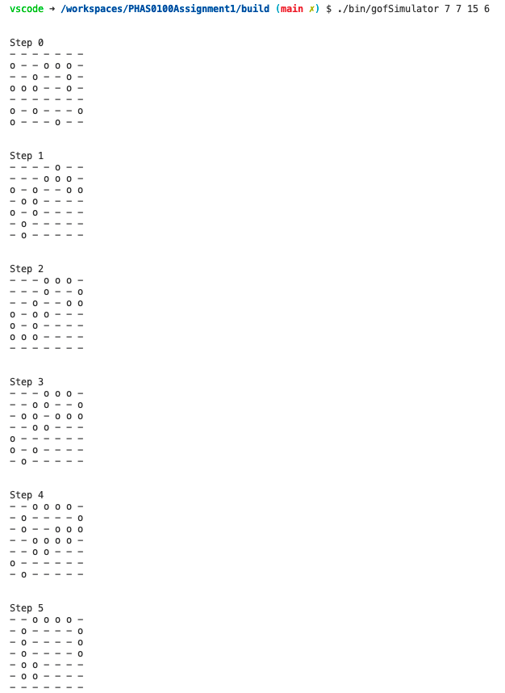
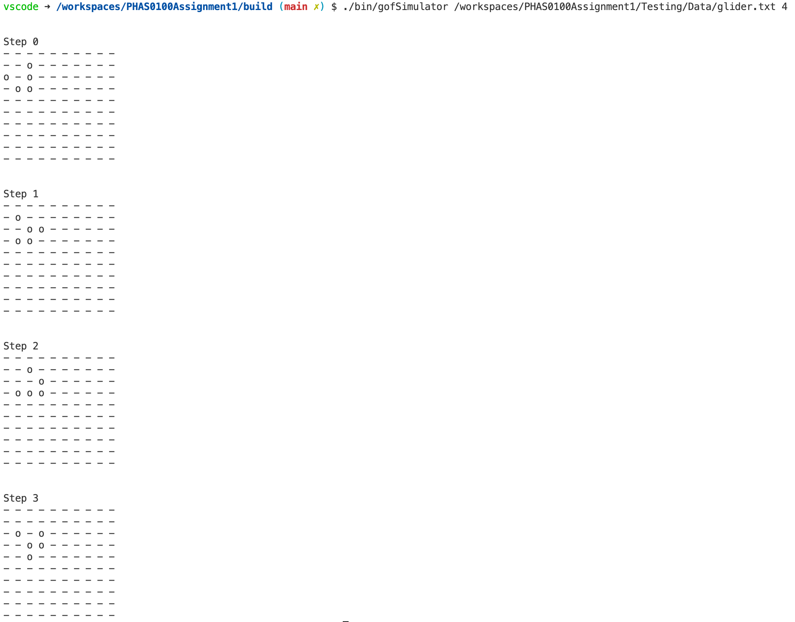
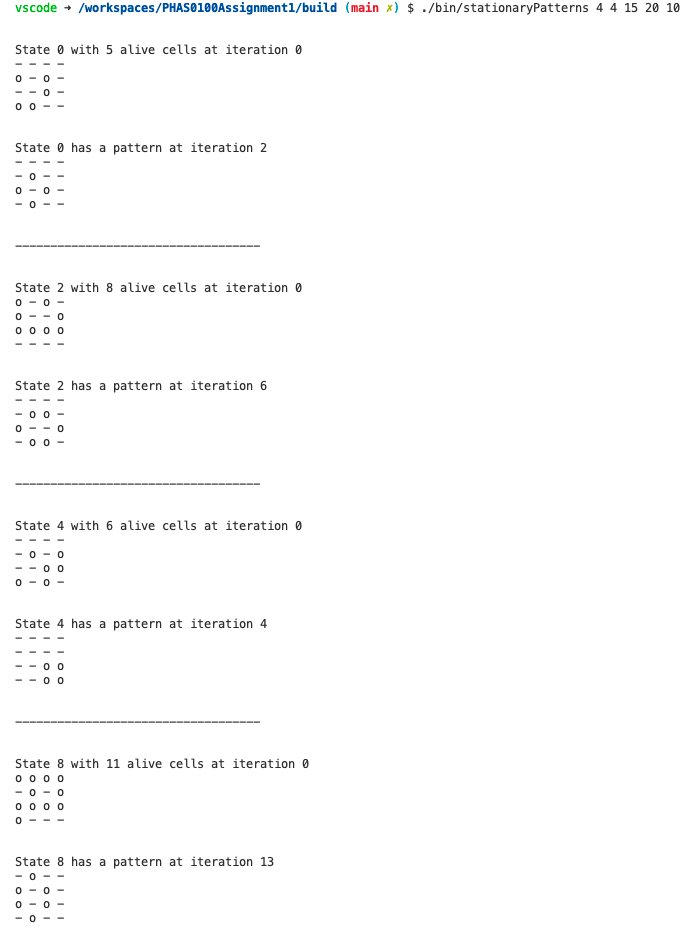

PHAS0100ASSIGNMENT1
------------------

[](https://travis-ci.com/[USERNAME]/PHAS0100Assignment1)
[](https://ci.appveyor.com/project/[USERNAME]/PHAS0100Assignment1)


Purpose
-------

This project serves as a starting point for the PHAS0100 2021/22 Assignment 1 Game of Life Simulation coursework. It has a reasonable folder structure for [CMake](https://cmake.org/) based projects,
that use [CTest](https://cmake.org/) to run unit tests via [Catch](https://github.com/catchorg/Catch2). 

This project aims at simualting Conway’s Game of Life, consisiting of 2D cellular automaton devised by the British mathematician John Conway in 1970. The rules of the game are very simple:
    1) A live cell with two or three alive neighbours remains alive.
    2) A dead cell with three live neighbours becomes a live cell.
    3) All other live and dead cells die in the next generation.

In the DataStructure class we have build a simulation app that defines the game structure given a set of initial conditions. These conditions could be a filepath to a .txt file or the dimensions, number of alive cells and iterations. Moreover, in the gameEvolution class we have defined the rules necessary to evolve our system according to the rules defined above. 

Finally, in the golBasicTest file we have defined a set of tests to check the correct functioning of the files. Here, we check for correct output and input types, ranges, dimensions, etc.


Credits
-------

This project is maintained by [Dr. Jim Dobson](https://www.ucl.ac.uk/physics-astronomy/people/dr-jim-dobson). It is based on [CMakeCatch2](https://github.com/UCL/CMakeCatch2.git) that was originally developed as a teaching aid for UCL's ["Research Computing with C++"](http://rits.github-pages.ucl.ac.uk/research-computing-with-cpp/)
course developed by [Dr. James Hetherington](http://www.ucl.ac.uk/research-it-services/people/james)
and [Dr. Matt Clarkson](https://iris.ucl.ac.uk/iris/browse/profile?upi=MJCLA42).


Build Instructions
------------------

First, we need to build the build function and create the CMake files necessary to run the game. To do this, we have to make sure we are in the correct directory: this is PHAS0100Assignment1.Then, the following arguments should be given to the command line:

```shell
mkdir build
cd build
cmake ..
make
```

The game can be accessed by running the executable ./bin/gofSimulator and specifying the arguments through the command line. Specifically, what you can run is:

```shell
./bin/gofSimulator
./bin/gofSimulator --help (-h)
./bin/gofSimulator filepath iterations
./bin/gofSimulator rows columns cells
./bin/gofSimulator rows columns cells iterations
```

In order to check if the system evolves to a stationary pattern, we have build the stationaryPattern command line that prints the original and final stationaty pattern, if there is any. To check for patterns, you should run the executable ./bin/stationaryPatterns and specifying the arguments through the command line. Specifically, what you can run is:

```shell
./bin/stationaryPatterns
./bin/stationaryPatterns --help (-h)
./bin/stationaryPatterns rows columns cells iterations states  
```

In order to check that the tests are working, run ./bin/golBasicTest


Results
------------------

- 7 by 7 grid with 15 alive cells after 6 iterations

- glider.txt grid after 4 iterations

- 4 by 4 grid with a maximum of 15 alive cells for 10 different configurations iterated 20 times each. The following are some examples of the patterns found  
